# Cara Menggunakan Menggunakan Docker melalui WSL (Windows Subsystem for Linux)

Dokumentasi ini mencakup langkah-langkah konfigurasi Docker menggunakan WSL, termasuk inisiasi Docker image, menjalankan container, serta langkah-langkah bedah container dan optimasi resource.

---

## 1. Inisiasi Docker Image Menggunakan Dockerfile

Untuk membuat Docker image menggunakan Dockerfile, ikuti langkah-langkah berikut:

### **Langkah 1: Install Docker pada WSL**
1. **Install Docker di WSL**:
   - Pastikan Anda sudah menginstal WSL 2 dan mengonfigurasi distribusi Linux yang sesuai.
   - Instal Docker Desktop untuk Windows melalui https://www.docker.com, yang akan mengintegrasikan Docker dengan WSL.
   
2. **Verifikasi Instalasi**:
   Jalankan perintah berikut untuk memverifikasi apakah Docker sudah terinstal dan berjalan:
   ```bash
   docker --version
   ```
   Output:

   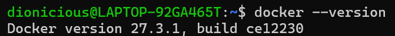

### **Langkah 2: Membuat Dockerfile**
1. **Buat sebuah direktori baru untuk proyek Docker Anda**:
   ```bash
   mkdir my-docker-project
   cd my-docker-project
   ```
   Output:

   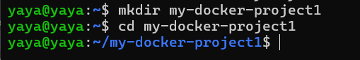

2. **Buat file `Dockerfile`**:
   Di dalam direktori proyek, buat file bernama `Dockerfile` dengan cara:
   ```bash
   touch Dockerfile
   ```
   Output:

   

   Setelah itu, edit Dockerfile tersebut dengan cara:
   ```bash
   nano Dockerfile
   ```
   Output:

   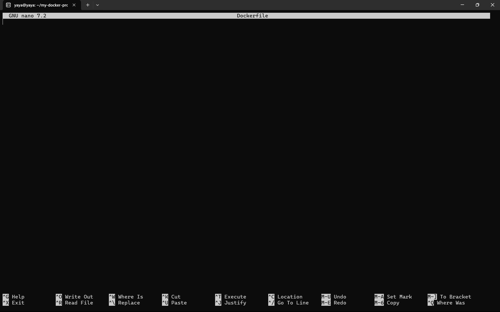

   setelah masuk ke dalam editor, isi file `Dockerfile` sesuai kebutuhan project, contohnya sebagai berikut:
   ```dockerfile
   #Gunakan PHP 8.2 dengan Apache
    FROM php:8.2-apache

    #Salin file PHP ke direktori yang sesuai di dalam container
    COPY ./php /var/www/html

    #Expose port 80 untuk Apache
    EXPOSE 80
   ```
    Output:

    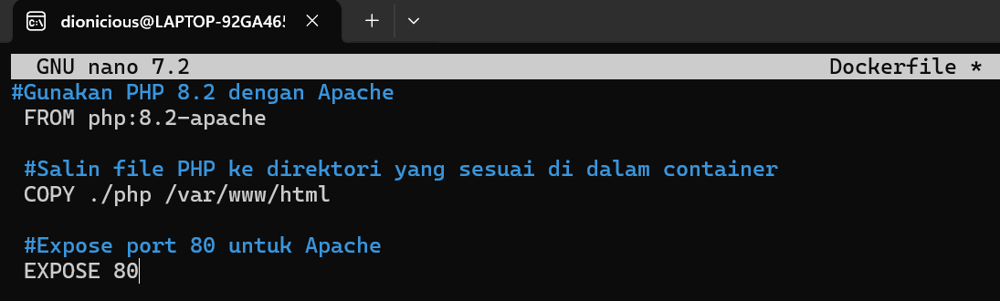
    Setelah mengisikan Dockerfile dengan kode di atas, simpan perubahannya dengan menekan `ctrl+o`, tekan `enter` untuk konfirmasi, lalu tekan `ctrl+x` untuk kembali ke menu utama.

3. **Buat file `index.php`:**
   ```bash
   mkdir php
   cd php
   touch index.php
   ```
   Output:

   


4. **Isi file `index.php` dengan kode berikut:**
   ```php
   <?php
   echo "Hello, World from Docker!";
   ?>
   ```
   Output:

   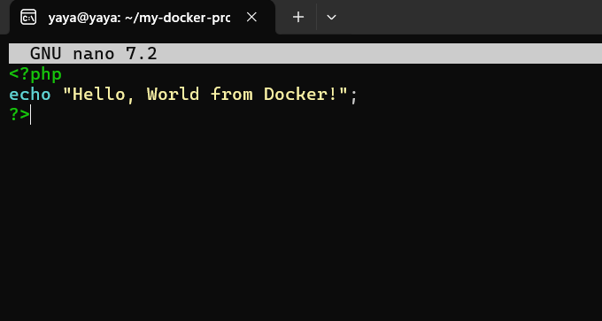

5. **Build Docker image:**
   ```bash
   docker build -t hello-world-php .
   ```
   Output:

   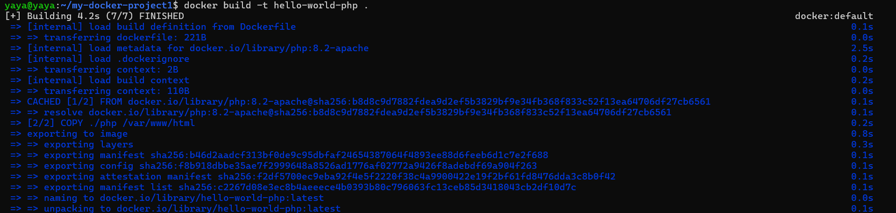

---

## 2. Running Container

### **Langkah-langkah:**
1. Jalankan container menggunakan image yang telah dibuat:
   ```bash
   docker run -d -p 8080:80 --name hello-world-container hello-world-php
   ```
   Output:

   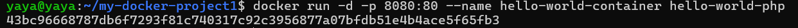

2. Verifikasi apakah container berjalan:
   ```bash
   docker ps
   ```
   Output:

   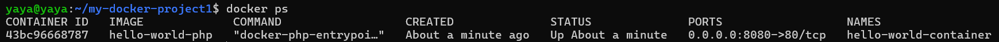

3. Buka browser atau gunakan `curl` untuk memeriksa aplikasi:
   ```bash
   curl http://localhost:8080
   ```
   Hasilnya akan menampilkan: `Hello, World from Docker!`
   Output:

   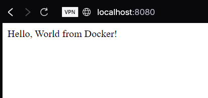
---

## 3. Bedah Container

### **Command yang Digunakan:**

1. **List perangkat di `/dev/`**:
   ```bash
   docker exec hello-world-container ls /dev/
   ```
   Output:

   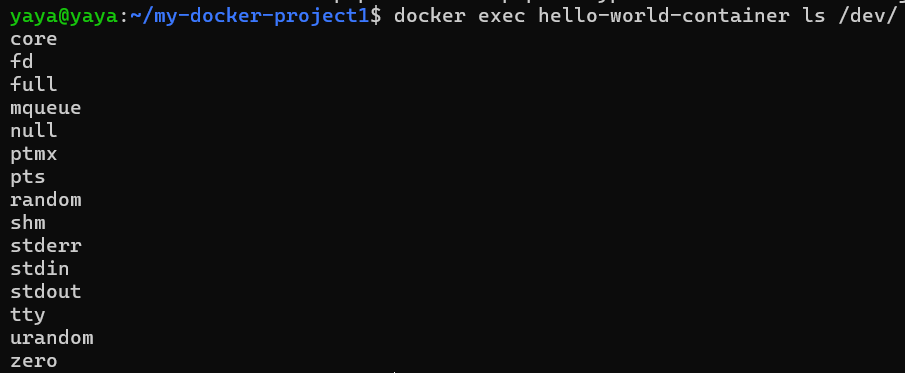

2. **Informasi tentang OS dalam container**:
   ```bash
   docker exec hello-world-container cat /etc/os-release
   ```
   Output:

   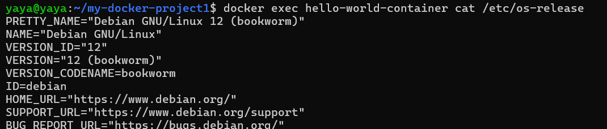

3. **Melihat struktur direktori root container**:
   ```bash
   docker exec hello-world-container ls -l /
   ```
   Output:

   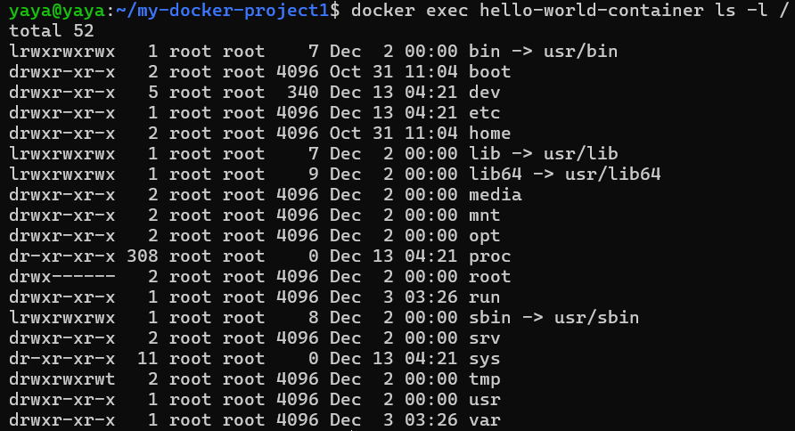

4. **Melihat file di direktori web server**:
   ```bash
   docker exec hello-world-container ls -l /var/www/html
   ```
   Output:

   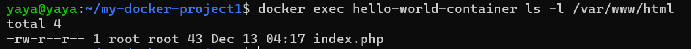

5. **Memeriksa proses yang berjalan**:
   ```bash
   docker exec hello-world-container ps aux
   ```
   Output:

   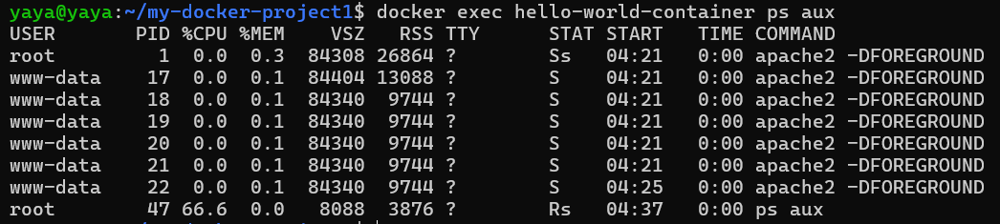

---

## 4. Optimasi Resources

### **Langkah-langkah:**

1. **Batasi penggunaan CPU:**
   Jalankan container dengan batas CPU (misalnya 50% dari 1 core):
   ```bash
   docker run -d -p 8080:80 --name hello-world-container --cpus="0.5" hello-world-php
   ```
   Output:

   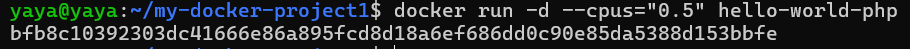

2. **Batasi penggunaan RAM:**
   Jalankan container dengan batas RAM (misalnya 256MB):
   ```bash
   docker run -d -p 8080:80 --name hello-world-container --memory="256m" hello-world-php
   ```
   Output:

   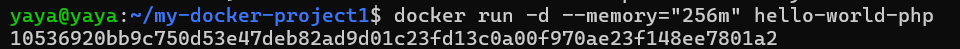

3. **Optimasi layer pada Dockerfile:**
   
   Gabungkan perintah yang sering digunakan untuk mengurangi layer:
   ```dockerfile
   FROM php:8.0-apache
   COPY index.php /var/www/html/
   EXPOSE 80
   ```
   Hindari salinan file yang tidak diperlukan ke dalam container.
   Output:

   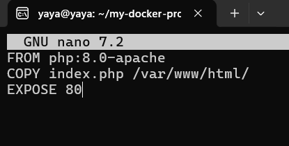

4. **Hentikan container yang tidak aktif untuk mengosongkan resource:**
   ```bash
   docker stop hello-world-container
   docker rm hello-world-container
   ```
   Output:

   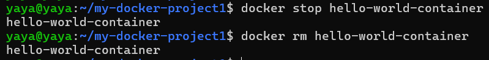


   
---

## Penutup
Dokumentasi ini menjelaskan langkah-langkah mulai dari inisiasi image menggunakan Dockerfile, menjalankan container, mempelajari container, hingga mengoptimalkan resource dalam WSL. Ikuti setiap langkah dengan seksama untuk keberhasilan implementasi.
