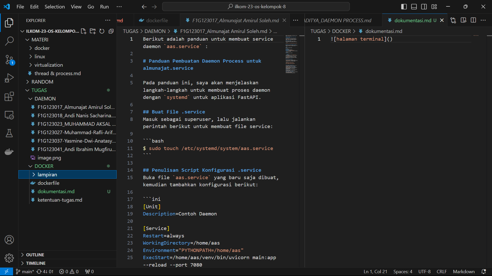

# Dokumentasi Proyek Docker

## **1. Inisiasi Docker Image**

### **Langkah-langkah**
1. **Install Docker**:
   - Pastikan Docker telah terinstal di sistem Anda. Verifikasi instalasi dengan perintah:
     ```bash
     docker --version
     ```

2. **Pull Docker Image dari Docker Hub**:
   - Unduh image yang diperlukan dari Docker Hub menggunakan perintah berikut:
     ```bash
     docker pull [image_name:tag]
     ```
   - Contoh:
     ```bash
     docker pull ubuntu:latest
     ```

3. **Cek Image yang Sudah Diunduh**:
   - Pastikan image telah berhasil diunduh dengan menjalankan:
     ```bash
     docker images
     ```

---

## **2. Menjalankan Container (Running Container)**

### **Langkah-langkah**
1. **Menjalankan Container Baru**:
   - Jalankan container dari image dengan perintah berikut:
     ```bash
     docker run -it --name [container_name] [image_name]
     ```
   - Contoh:
     ```bash
     docker run -it --name my_ubuntu_container ubuntu
     ```

2. **Melihat Daftar Container yang Sedang Berjalan**:
   - Tampilkan daftar container aktif dengan:
     ```bash
     docker ps
     ```

3. **Melihat Semua Container (Termasuk yang Berhenti)**:
   - Gunakan perintah berikut untuk melihat semua container:
     ```bash
     docker ps -a
     ```

4. **Menghentikan Container**:
   - Hentikan container yang sedang berjalan dengan:
     ```bash
     docker stop [container_id/container_name]
     ```

5. **Menghapus Container**:
   - Hapus container yang tidak diperlukan dengan perintah:
     ```bash
     docker rm [container_id/container_name]
     ```

---

## **3. Bedah Container**

### **Langkah-langkah**
1. **Masuk ke dalam Container**:
   - Untuk masuk ke dalam container yang sedang berjalan, gunakan:
     ```bash
     docker exec -it [container_name] /bin/bash
     ```

2. **Memeriksa Struktur File di Dalam Container**:
   - Contoh perintah eksplorasi:
     ```bash
     ls /dev/
     cat /etc/os-release
     df -h
     free -m
     ps aux
     ```

3. **Keluar dari Container**:
   - Untuk keluar dari container, cukup ketikkan:
     ```bash
     exit
     ```

---

## **4. Optimasi Resources**

### **Langkah-langkah**
1. **Membatasi CPU dan Memori**:
   - Batasi penggunaan CPU dan memori dengan opsi `--cpus` dan `--memory`:
     ```bash
     docker run -it --name [container_name] --cpus="1.0" --memory="512m" [image_name]
     ```

2. **Membersihkan Resources yang Tidak Digunakan**:
   - Hapus container yang tidak digunakan:
     ```bash
     docker rm [container_id/container_name]
     ```
   - Hapus image yang tidak diperlukan:
     ```bash
     docker rmi [image_name]
     ```
   - Bersihkan semua resource yang tidak diperlukan:
     ```bash
     docker system prune -a
     ```

3. **Monitoring Resources**:
   - Pantau penggunaan sumber daya container dengan:
     ```bash
     docker stats
     ```

---

## **5. Output Tugas yang Diharapkan**

### **GitHub Project**
- Sebuah repositori GitHub yang berisi:
  - Dockerfile untuk membangun image kustom.
  - File dokumentasi ini.
  - Screenshot dari hasil percobaan menggunakan Docker.

### **Dockerfile**
Contoh sederhana Dockerfile:
```dockerfile
# Menggunakan image Ubuntu
FROM ubuntu:latest

# Menambahkan informasi pemelihara
LABEL maintainer="email@example.com"

# Menginstal package dasar
RUN apt-get update && apt-get install -y \
    curl \
    vim \
    git && \
    apt-get clean

# Menentukan command default
CMD ["/bin/bash"]
```

### **Screenshot**
- Tambahkan file screenshot hasil percobaan ke dalam repositori.
  - Contoh screenshot:
    - Output dari `docker ps`.
    - Output dari `docker stats`.
    - Struktur file dalam container menggunakan `ls`.

---

Jika ada bagian yang perlu diperbaiki atau ditambahkan, silakan beri masukan!


