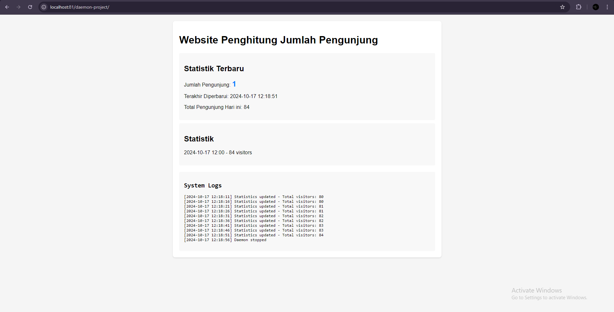
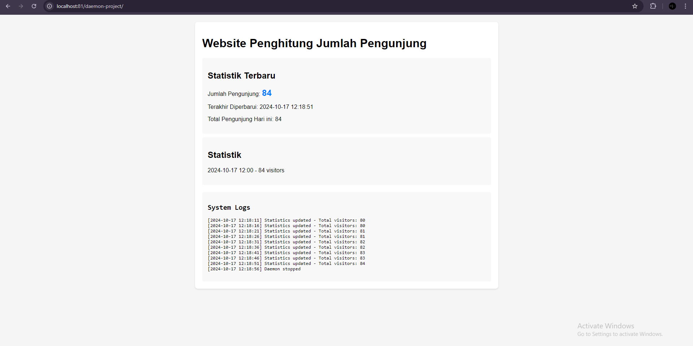
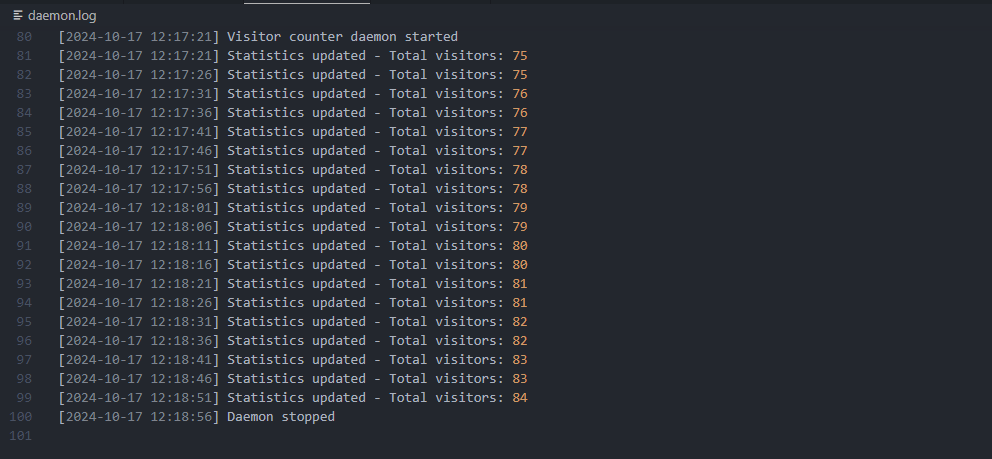

# Proses Menjalankan Website Daftar Hadir dengan Daemon Process menggunakan Laragon

## 1. Pendahuluan
Pada kasus ini, kita akan membahas penerapan **daemon process** untuk menangani tugas-tugas yang berjalan di latar belakang, seperti pemrosesan data otomatis tanpa interaksi langsung pengguna. Daemon process ini akan membantu dalam mengelola antrian kehadiran, memprosesnya secara otomatis setiap beberapa detik. Pengembangan akan menggunakan **Laragon** sebagai server lokal, dan daemon akan diimplementasikan menggunakan **NSSM** agar dapat berjalan terus-menerus sebagai service di Windows.

## 2. Persiapan
Sebelum memulai, pastikan software yang diperlukan Anda sudah siap, termasuk:
- **Laragon** sebagai server lokal
- **NSSM** (Non-Sucking Service Manager) sebagai tool untuk menjalankan PHP sebagai service di Windows

## 3. Struktur Proyek
Struktur folder proyek Anda sebagai berikut:
```
C:\laragon\www\daemon-project
├── daemon.php
├── index.php
├── visitors.txt
├── stats.json
└── daemon.log
```

## 4. Membuat Website
Saya membuat contoh website dengan php, contoh kasus yang saya ambil merupakan **Website Penghitung Jumlah Pengunjung dalam suatu Website**
Dalam file `index.php`, tuliskan isi program untuk sebagai tampilan dari website. Berikut adalah contoh kode:

```php
<?php
// index.php
class VisitorCounter {
    private $visitorFile;
    private $statsFile;
    private $logFile;

    public function __construct() {
        $this->visitorFile = __DIR__ . '/visitors.txt';
        $this->statsFile = __DIR__ . '/stats.json';
        $this->logFile = __DIR__ . '/daemon.log';
        
        // Buat file pengunjung jika belum ada
        if (!file_exists($this->visitorFile)) {
            file_put_contents($this->visitorFile, '0');
        }
    }

    public function incrementVisitor() {
        $count = (int)file_get_contents($this->visitorFile);
        $count++;
        file_put_contents($this->visitorFile, $count);
        return $count;
    }

    public function getStats() {
        if (file_exists($this->statsFile)) {
            return json_decode(file_get_contents($this->statsFile), true);
        }
        return null;
    }

    public function getLogs($lines = 10) {
        if (file_exists($this->logFile)) {
            $logs = file($this->logFile);
            return array_slice($logs, -$lines);
        }
        return [];
    }

    public function getDaemonStatus() {
        return file_exists(__DIR__ . '/daemon.pid') ? 'Running' : 'Stopped';
    }
}

// Inisialisasi counter
$counter = new VisitorCounter();
$visitorCount = $counter->incrementVisitor();
$stats = $counter->getStats();
?>

<!DOCTYPE html>
<html>
<head>
    <title>Simple Visitor Counter</title>
    <style>
        body {
            font-family: Arial, sans-serif;
            margin: 20px;
            background: #f5f5f5;
        }
        .container {
            max-width: 800px;
            margin: 0 auto;
            background: white;
            padding: 20px;
            border-radius: 8px;
            box-shadow: 0 2px 4px rgba(0,0,0,0.1);
        }
        .stats-box {
            background: #f8f8f8;
            padding: 15px;
            border-radius: 4px;
            margin: 10px 0;
        }
        .counter {
            font-size: 24px;
            font-weight: bold;
            color: #007bff;
        }
        .logs {
            background: #f8f8f8;
            padding: 15px;
            border-radius: 4px;
            margin-top: 20px;
            font-family: monospace;
        }
    </style>
</head>
<body>
    <div class="container">
        <h1>Website Penghitung Jumlah Pengunjung</h1>
        
        <div class="stats-box">
            <h2>Statistik Terbaru</h2>
            <p>Jumlah Pengunjung: <span class="counter"><?php echo $visitorCount; ?></span></p>
            <?php if ($stats): ?>
                <p>Terakhir Diperbarui: <?php echo $stats['last_updated']; ?></p>
                <p>Total Pengunjung Hari ini: <?php echo $stats['total_visitors']; ?></p>
            <?php endif; ?>
        </div>

        <div class="stats-box">
            <h2>Statistik</h2>
            <?php if ($stats && isset($stats['hourly_stats'])): ?>
                <?php foreach(array_slice($stats['hourly_stats'], -5) as $hour => $count): ?>
                    <p><?php echo $hour; ?>:00 - <?php echo $count; ?> visitors</p>
                <?php endforeach; ?>
            <?php endif; ?>
        </div>

        <div class="logs">
            <h2>System Logs</h2>
            <pre><?php
            foreach($counter->getLogs() as $log) {
                echo htmlspecialchars($log);
            }
            ?></pre>
        </div>
    </div>

    <script>
        // Refresh halaman setiap 10 detik
        setTimeout(function() {
            location.reload();
        }, 10000);
    </script>
</body>
</html>
```

## 5. Membuat Daemon Process
Dalam file `daemon.php`, tuliskan logika untuk mengelola statistik pengunjung dan mencatat aktivitas. Berikut adalah contoh kode untuk daemon process:

```php
<?php
class VisitorDaemon {
    private $logFile;
    private $statsFile;
    private $isRunning;

    public function __construct() {
        $this->logFile = __DIR__ . '/daemon.log';
        $this->statsFile = __DIR__ . '/stats.json';
        $this->isRunning = true;

        // Buat file stats.json jika belum ada
        if (!file_exists($this->statsFile)) {
            $initialStats = [
                'total_visitors' => 0,
                'last_updated' => date('Y-m-d H:i:s'),
                'hourly_stats' => []
            ];
            file_put_contents($this->statsFile, json_encode($initialStats, JSON_PRETTY_PRINT));
        }
    }

    public function writeLog($message) {
        $timestamp = date('Y-m-d H:i:s');
        file_put_contents($this->logFile, "[$timestamp] $message\n", FILE_APPEND);
    }

    public function updateStats() {
        $stats = json_decode(file_get_contents($this->statsFile), true);
        $currentHour = date('Y-m-d H');
        
        // Update statistik per jam
        if (!isset($stats['hourly_stats'][$currentHour])) {
            $stats['hourly_stats'][$currentHour] = 0;
        }
        
        // Ambil jumlah pengunjung dari visitors.txt
        if (file_exists(__DIR__ . '/visitors.txt')) {
            $currentVisitors = (int)file_get_contents(__DIR__ . '/visitors.txt');
            $stats['total_visitors'] = $currentVisitors;
            $stats['hourly_stats'][$currentHour] = $currentVisitors;
        }
        
        $stats['last_updated'] = date('Y-m-d H:i:s');
        
        // Simpan kembali statistik
        file_put_contents($this->statsFile, json_encode($stats, JSON_PRETTY_PRINT));
        $this->writeLog("Statistics updated - Total visitors: " . $stats['total_visitors']);
    }

    public function start() {
        $this->writeLog("Visitor counter daemon started");

        while ($this->isRunning) {
            $this->updateStats();
            sleep(5); // Update setiap 5 detik

            if (file_exists(__DIR__ . '/stop.flag')) {
                $this->isRunning = false;
                unlink(__DIR__ . '/stop.flag');
                $this->writeLog("Daemon stopped");
            }
        }
    }
}

// Jalankan daemon
$daemon = new VisitorDaemon();
$daemon->start();
?>
```

## 6. Menjalankan Daemon Process
1. Buka command line di Laragon.
2. Arahkan ke direktori proyek Anda:
   ```bash
   cd C:\laragon\www\daemon-project
   ```
3. Jalankan daemon process dengan perintah:
   ```bash
   php daemon.php
   ```
4. Pastikan daemon process berjalan di latar belakang dan memperbarui statistik secara otomatis.

## 7. Memantau Statistik dan Log
Data pengunjung dan statistik akan disimpan di `visitors.txt` dan `stats.json`, sedangkan log aktivitas daemon akan disimpan di `daemon.log`. Anda bisa membuka file ini untuk melihat pesan terkait aktivitas yang telah dilakukan oleh daemon process.

## 8. Bukti Screenshoot Program Berhasil Berjalan

## Tampilan Website

## Tampilan Website Berhasil Menghitung Pengunjung

## Daemon Process Berhasil Menampilkan Log Aktivitas

